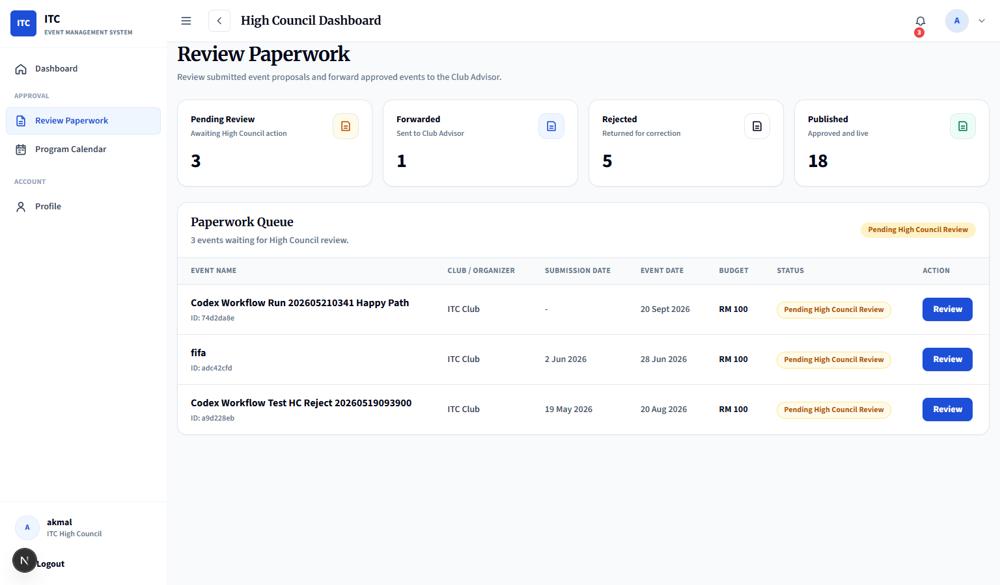
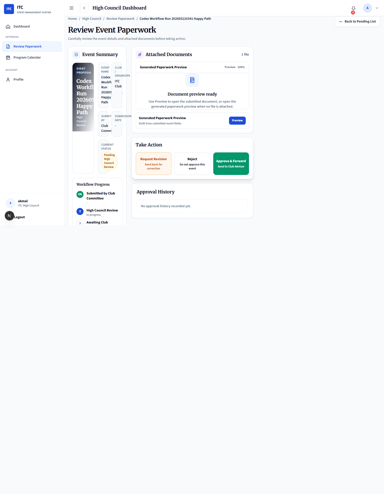

# High Council Review Page Redesign Report

Generated: 2026-06-06 15:18:36 +08:00

## Scope

Redesigned the High Council Review Paperwork module into a two-stage workflow while preserving the existing approval workflow logic, route protection, API calls, and database structure.

No database schema changes were made.
No migration was created.
No `supabase db push` was run.

## Stage 1 - Review Queue Page

Implemented a dedicated queue-first experience for High Council users at `/high-council/events`.

The queue page now includes:

- Page header: `Review Paperwork`
- Subtitle explaining that High Council reviews submitted proposals and forwards approved events to Club Advisor
- Summary cards:
  - Pending Review
  - Forwarded
  - Rejected
  - Published
- Professional review queue table with:
  - Event Name
  - Club / Organizer
  - Submission Date
  - Event Date
  - Budget
  - Status
  - Action
- Responsive mobile card layout
- `Review` action that opens the detailed workspace

Screenshot:



## Stage 2 - Review Workspace Page

Implemented a detailed review workspace that opens after selecting a queue item.

The workspace now includes:

- Breadcrumb:
  - Home
  - High Council
  - Review Paperwork
  - Event Name
- `Back to Pending List` action
- Event Summary section with:
  - Poster or generated visual placeholder
  - Event Name
  - Club / Organizer
  - Submitted By
  - Submission Date
  - Current Status
- Workflow Progress:
  - Submitted by Club Committee
  - High Council Review
  - Awaiting Club Advisor Approval
  - Event Published
- Program Details:
  - Purpose
  - Objectives
  - Expected Outcome
- Logistics & Budget:
  - Start Date
  - End Date
  - Time
  - Location
  - Expected Participants
  - Estimated Budget
- Attached Documents panel:
  - Preview area
  - Preview button
  - Download button
  - File size when available
  - Generated paperwork preview fallback when no uploaded file is attached
- Review Notes textarea
- Sticky Take Action section:
  - Request Revision
  - Reject
  - Approve & Forward
- Approval History using existing `approval_history` data

Screenshot:



## Files Changed

- `lib/EventApprovalPage.tsx`
- `HIGH_COUNCIL_REVIEW_PAGE_REDESIGN_REPORT.md`
- `high-council-review-queue-redesign.png`
- `high-council-review-workspace-redesign.png`

## Validation Results

Local browser validation was performed using the High Council demo account.

Verified:

- `/high-council/events` opens to the Stage 1 queue page first
- Queue summary cards render successfully
- Queue table renders submitted paperwork items
- `Review` button opens the selected event workspace
- Workspace sections are visible:
  - Event Summary
  - Workflow Progress
  - Program Details
  - Logistics & Budget
  - Attached Documents
  - Review Notes
  - Take Action
  - Approval History
- `Back to Pending List` returns the user from workspace to queue
- Existing signed URL attachment workflow is reused
- Existing `/api/events/review-paperwork` decision workflow is reused

## Build Results

Command:

```powershell
npm.cmd run lint
```

Result: Passed with existing warnings only.

Command:

```powershell
npm.cmd run build
```

Result: Passed.

## Notes

- `Request Revision` and `Reject` both use the existing rejection transition because the current workflow stores correction requests through the existing rejected status and review notes.
- No workflow logic was changed.
- No database structure was changed.
- The Club Advisor route continues to use the existing shared approval component behavior.

## Readiness

Ready for Vercel deployment after review.
