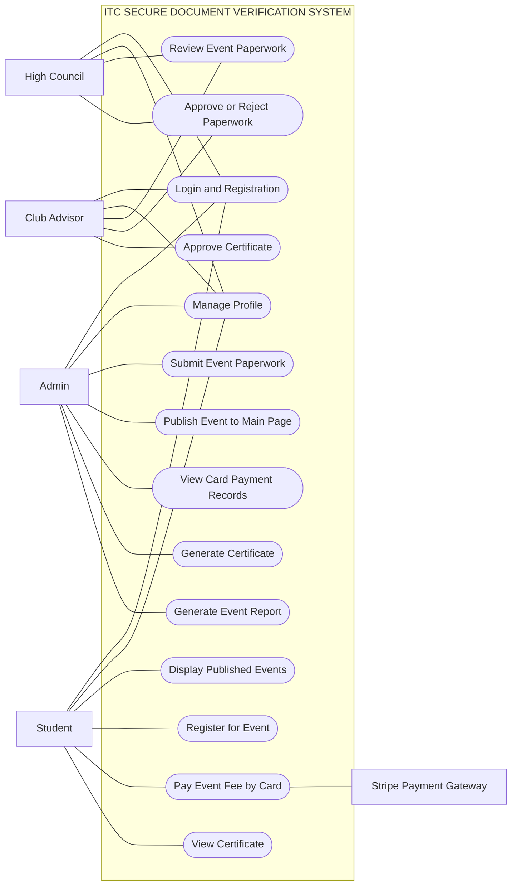

# Use Case Specification

## System Name

ITC Secure Document Verification System

## System Overview

The ITC Secure Document Verification System manages event paperwork approval, event publishing, student registration, card payment tracking, and certificate issuance for ITC events. The system supports several user roles with different responsibilities in the event approval and certificate workflow.

## Actors

| Actor | Description |
| --- | --- |
| Admin | Creates event paperwork, monitors approval status, publishes approved events, tracks card payments, and generates certificates. |
| High Council | Reviews submitted event paperwork and either forwards it to the Club Advisor or rejects it with a reason. |
| Club Advisor | Gives final approval or rejection for event paperwork and approves generated certificates. |
| Student | Views published events, registers for events, pays by card, and views approved certificates. |
| Stripe Payment Gateway | External payment service used to process card payments. |

## Use Case Diagram



## Simple Diagram View

This is the same diagram written in a layout similar to a traditional use case drawing.

```text
                         ITC SECURE DOCUMENT VERIFICATION SYSTEM
        -----------------------------------------------------------------------
       |                                                                       |
       |                         ( Login and Registration )                    |
       |                                                                       |
       |                         ( Manage Profile )                            |
       |                                                                       |
       |                         ( Submit Event Paperwork )                    |
       |                                                                       |
Admin  |                         ( Review Event Paperwork )          Club      |
High   |                         ( Approve or Reject Paperwork )      Advisor  |
Council|                                                                       |
Student|                         ( Publish Event to Main Page )                 |
       |                                                                       |
       |                         ( Display Published Events )                   |
       |                                                                       |
       |                         ( Register for Event )                         |
       |                                                                       |
       |                         ( Pay Event Fee by Card ) ---- Stripe          |
       |                                                                       |
       |                         ( View Card Payment Records )                  |
       |                                                                       |
       |                         ( Generate Certificate )                       |
       |                                                                       |
       |                         ( Approve Certificate )                        |
       |                                                                       |
       |                         ( View Certificate )                           |
       |                                                                       |
       |                         ( Generate Event Report )                      |
       |                                                                       |
        -----------------------------------------------------------------------
```

## Actor And Use Case Relationship

| Actor | Related Use Cases |
| --- | --- |
| Admin | Login and Registration, Manage Profile, Submit Event Paperwork, Publish Event to Main Page, View Card Payment Records, Generate Certificate, Generate Event Report |
| High Council | Login and Registration, Manage Profile, Review Event Paperwork, Approve or Reject Paperwork |
| Club Advisor | Login and Registration, Manage Profile, Review Event Paperwork, Approve or Reject Paperwork, Approve Certificate |
| Student | Login and Registration, Manage Profile, Display Published Events, Register for Event, Pay Event Fee by Card, View Certificate |
| Stripe Payment Gateway | Process card payment for event fee |

## Main Use Cases

### UC01: Submit Event Paperwork

| Item | Description |
| --- | --- |
| Primary Actor | Admin |
| Goal | Submit event paperwork for approval. |
| Preconditions | Admin is logged in. |
| Trigger | Admin wants to organize a new event. |
| Main Flow | 1. Admin opens the Paperwork page. 2. Admin fills in event details. 3. Admin submits the paperwork. 4. System stores the event with `Pending High Council Approval` status. |
| Alternative Flow | If required fields are missing, the system displays validation errors and does not submit the paperwork. |
| Postconditions | Event paperwork is ready for High Council review. |

### UC02: Review And Approve Paperwork

| Item | Description |
| --- | --- |
| Primary Actors | High Council, Club Advisor |
| Goal | Review submitted paperwork and approve it through the required approval stages. |
| Preconditions | Event paperwork has been submitted by Admin. |
| Trigger | Reviewer opens the paperwork review page. |
| Main Flow | 1. High Council views pending paperwork. 2. High Council sends valid paperwork to Club Advisor. 3. Club Advisor reviews the paperwork. 4. Club Advisor approves the paperwork. 5. System updates the event status to `Approved`. |
| Alternative Flow | High Council or Club Advisor rejects the paperwork and enters a rejection reason. |
| Postconditions | Event is either approved or rejected with a visible reason. |

### UC03: Resubmit Rejected Paperwork

| Item | Description |
| --- | --- |
| Primary Actor | Admin |
| Goal | Correct and resubmit rejected paperwork. |
| Preconditions | Event paperwork has been rejected by High Council or Club Advisor. |
| Trigger | Admin sees a rejected event. |
| Main Flow | 1. Admin reviews the rejection reason. 2. Admin updates the paperwork if needed. 3. Admin resubmits the paperwork. 4. System sends the paperwork back into the approval workflow. |
| Postconditions | Paperwork is pending approval again. |

### UC04: Publish Approved Event

| Item | Description |
| --- | --- |
| Primary Actor | Admin |
| Goal | Make an approved event visible on the public event page. |
| Preconditions | Event status is `Approved`. |
| Trigger | Admin chooses to show the event on the main page. |
| Main Flow | 1. Admin opens Event Management. 2. Admin selects an approved event. 3. Admin clicks `Show on Main Page`. 4. System marks the event as published. 5. Event appears on `/events`. |
| Alternative Flow | If the event is not approved, the system prevents publishing. |
| Postconditions | Students can view and register for the event. |

### UC05: Register For Event

| Item | Description |
| --- | --- |
| Primary Actor | Student |
| Goal | Register for a published event. |
| Preconditions | Student is logged in and the event is published. |
| Trigger | Student selects an event from the event list. |
| Main Flow | 1. Student opens Available Events. 2. Student selects an event. 3. Student clicks register. 4. System creates a registration record. |
| Alternative Flow | If the student already registered, the system prevents duplicate registration. |
| Postconditions | Student registration is recorded. |

### UC06: Pay Event Fee By Card

| Item | Description |
| --- | --- |
| Primary Actor | Student |
| Supporting Actor | Stripe Payment Gateway |
| Goal | Pay the event fee using card payment only. |
| Preconditions | Student has registered for a paid event. |
| Trigger | Student clicks `Pay by Card` from My Registrations. |
| Main Flow | 1. System creates a Stripe Checkout session. 2. Student completes card payment in Stripe Checkout. 3. Stripe confirms payment. 4. System updates payment status to `paid`. 5. Admin can view the card payment record. |
| Alternative Flow | If payment is cancelled or fails, the registration remains unpaid. |
| Postconditions | Paid registration becomes eligible for certificate generation. |

### UC07: Track Card Payments

| Item | Description |
| --- | --- |
| Primary Actor | Admin |
| Goal | View student card payment records. |
| Preconditions | Students have registered for events. |
| Trigger | Admin opens the Card Payments page. |
| Main Flow | 1. Admin views all payment records. 2. System displays student, event, amount, card reference, verified date, and payment status. 3. Admin filters payments by status if needed. |
| Postconditions | Admin can confirm which students have paid. |

### UC08: Generate Certificate

| Item | Description |
| --- | --- |
| Primary Actor | Admin |
| Goal | Generate certificates for paid students. |
| Preconditions | Student has registered and payment status is `paid`. |
| Trigger | Admin opens the Certificates page for an event. |
| Main Flow | 1. Admin selects an event. 2. System lists registered students. 3. Admin generates certificates for paid students. 4. System creates pending certificates. |
| Alternative Flow | If a student has not paid, the system blocks certificate generation. |
| Postconditions | Certificate is pending Club Advisor approval. |

### UC09: Approve Certificate

| Item | Description |
| --- | --- |
| Primary Actor | Club Advisor |
| Goal | Approve generated certificates. |
| Preconditions | Certificate has been generated by Admin. |
| Trigger | Club Advisor opens the Certificates page. |
| Main Flow | 1. Club Advisor views pending certificates. 2. Club Advisor checks certificate details. 3. Club Advisor approves the certificate. 4. System marks the certificate as approved. |
| Postconditions | Student can view the approved certificate. |

### UC10: View Certificate

| Item | Description |
| --- | --- |
| Primary Actor | Student |
| Goal | View approved certificate for an event. |
| Preconditions | Student certificate has been approved by Club Advisor. |
| Trigger | Student opens My Certificates. |
| Main Flow | 1. Student logs in. 2. Student opens My Certificates. 3. System displays approved certificates. 4. Student opens the certificate details page. |
| Postconditions | Student can access the official event certificate. |

## Overall Workflow Summary

1. Admin submits event paperwork.
2. High Council reviews the paperwork.
3. Club Advisor gives final approval.
4. Admin publishes the approved event.
5. Student registers for the event.
6. Student pays by card.
7. Admin verifies payment records and generates certificates.
8. Club Advisor approves certificates.
9. Student views the approved certificate.

## Business Rules

- Only approved events can be published to the public event page.
- Rejected paperwork must include a rejection reason.
- Students can only register for published events.
- Paid events use card payment only.
- Certificates can only be generated for paid registrations.
- Students can only view approved certificates.
- Completed events may no longer appear on the public event listing.
