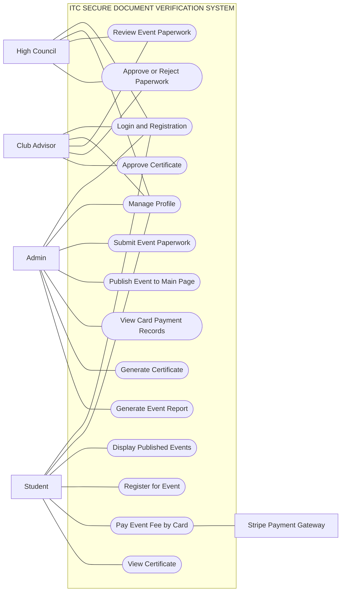

# ITC Secure Document Verification System Use Case Diagram



## Text Layout

```text
                         ITC SECURE DOCUMENT VERIFICATION SYSTEM
        -----------------------------------------------------------------------
       |                                                                       |
       |                         ( Login and Registration )                    |
       |                                                                       |
       |                         ( Manage Profile )                            |
       |                                                                       |
       |                         ( Submit Event Paperwork )                    |
       |                                                                       |
Admin  |                         ( Review Event Paperwork )          Club      |
High   |                         ( Approve or Reject Paperwork )      Advisor  |
Council|                                                                       |
Student|                         ( Publish Event to Main Page )                 |
       |                                                                       |
       |                         ( Display Published Events )                   |
       |                                                                       |
       |                         ( Register for Event )                         |
       |                                                                       |
       |                         ( Pay Event Fee by Card ) ---- Stripe          |
       |                                                                       |
       |                         ( View Card Payment Records )                  |
       |                                                                       |
       |                         ( Generate Certificate )                       |
       |                                                                       |
       |                         ( Approve Certificate )                        |
       |                                                                       |
       |                         ( View Certificate )                           |
       |                                                                       |
       |                         ( Generate Event Report )                      |
       |                                                                       |
        -----------------------------------------------------------------------
```

