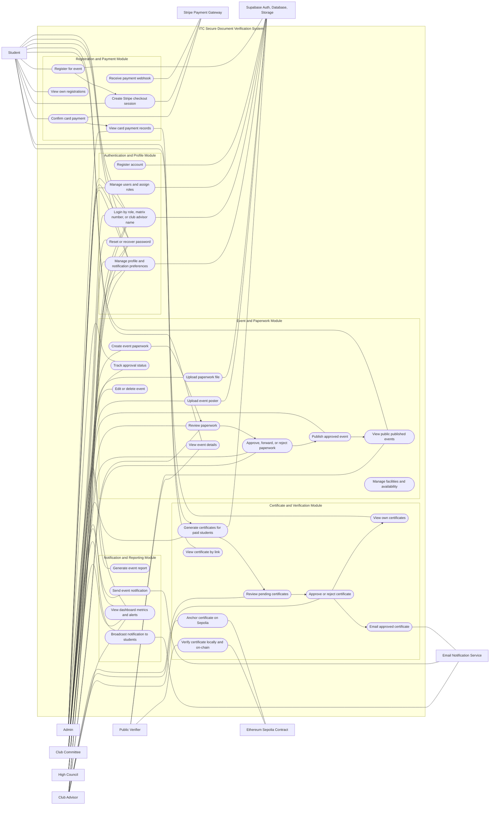

# ITC Secure Document Verification System Use Case Diagram

This use case diagram is derived from the current Next.js App Router pages, API routes, Supabase table usage, migrations, and role checks in the codebase.

## Mermaid Flowchart

## Actors Identified

| Actor | Evidence in current code | Main responsibility |
| --- | --- | --- |
| Public Verifier | `/verify-certificate`, certificate QR links, `/certificate/[id]` | Verify certificates publicly without login. |
| Student | `/student/*`, `AuthGuard requiredRole="student"` | Register for events, pay via Stripe, view registrations and certificates. |
| Admin | `/admin/*`, `AdminGuard`, admin-only API role checks | Manage users, roles, account status, system records, and reports. |
| Club Committee | `/committee/*`, `role === "committee"` | Create/edit event paperwork, upload participants, generate certificate drafts, submit for approval, and view feedback analytics. |
| High Council | `/high-council/*`, `role === "high_council"` | Review paperwork in `Pending High Council Approval` and forward or reject it. |
| Club Advisor | `/club-advisor/*`, `role === "club_advisor"` | Final paperwork approval and certificate approval/anchoring. |
| Stripe Payment Gateway | `/api/payments/*` | Processes card checkout and webhook payment updates. |
| Supabase | `lib/supabase.ts`, `lib/supabaseAdmin.ts`, migrations | Auth, database, RLS, storage buckets for paperwork and posters. |
| Email Notification Service | notification and certificate send APIs | Sends event notifications and certificate emails. |
| Ethereum Sepolia Contract | `/api/certificates/anchor-sepolia`, `/api/certificates/verify-sepolia` | Stores and verifies certificate hashes on-chain. |

## Modules And Main Tables

| Module | Routes/pages | Main tables or storage |
| --- | --- | --- |
| Authentication and Profile | `/login`, `/register`, `/forgot-password`, `/reset-password`, role profile pages | `users`, Supabase Auth, `event_notification_preferences` |
| Event and Paperwork | `/committee/event`, `/committee/approval-status`, `/high-council/events`, `/club-advisor/events`, `/events`, `/events/[id]` | `events`, `paperwork-files` storage, event poster storage |
| Registration and Payment | `/student/events`, `/student/registered-events`, `/admin/payments`, `/api/payments/*` | `event_registrations`, Stripe checkout/webhook metadata |
| Certificates | `/admin/certificates`, `/club-advisor/certificates`, `/student/certificates`, `/certificate/[id]`, `/verify-certificate` | `certificates`, `users`, `events`, Sepolia contract |
| Notifications and Reports | `/admin/report`, `/api/notifications/*`, dashboard summary APIs | `notification_logs`, `event_notification_preferences`, `events`, `event_registrations` |
| Facility Management | RLS migrations only | `facilities`, `facility_availability`, `events.facility_id` |

## Role-Based Access Summary

| Role | Current access pattern |
| --- | --- |
| `student` | Protected by `AuthGuard`; can read published events, create own event registrations, start/confirm own payments, and view own approved certificates. |
| `admin` | Protected by `AdminGuard` and `requireApiRole(["admin"])`; can manage users, roles, account status, system records, and reports. |
| `committee` | Protected in Committee layout; can create event paperwork, submit approvals, generate certificate drafts, and review feedback analytics. |
| `high_council` | Protected in layout and API checks; can view paperwork waiting for High Council and transition it to `Pending Club Advisor Approval` or `Rejected`. |
| `club_advisor` | Protected in layout and API checks; can view paperwork waiting for final approval, approve/reject paperwork, and approve/reject certificates. |

## Core Workflow

1. Club Committee creates event/program paperwork.
2. High Council reviews paperwork and forwards it to Club Advisor or rejects it with a reason.
3. Club Advisor gives final paperwork approval or rejection.
4. Event is published after final approval.
5. Student registers for a published event and pays through Stripe when required.
6. Event is completed.
7. Student submits feedback.
8. Certificate becomes available after feedback.
9. Club Advisor approves/issues and anchors certificates using the existing Sepolia workflow.
10. Public Verifier verifies the certificate by QR code or certificate ID.
